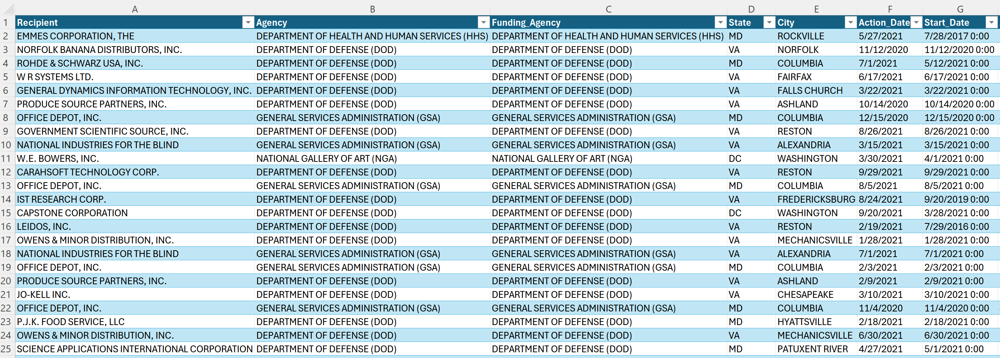
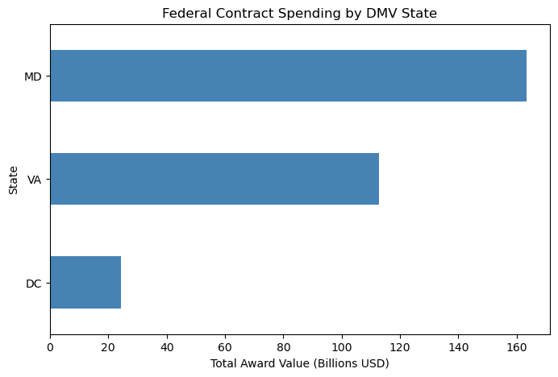
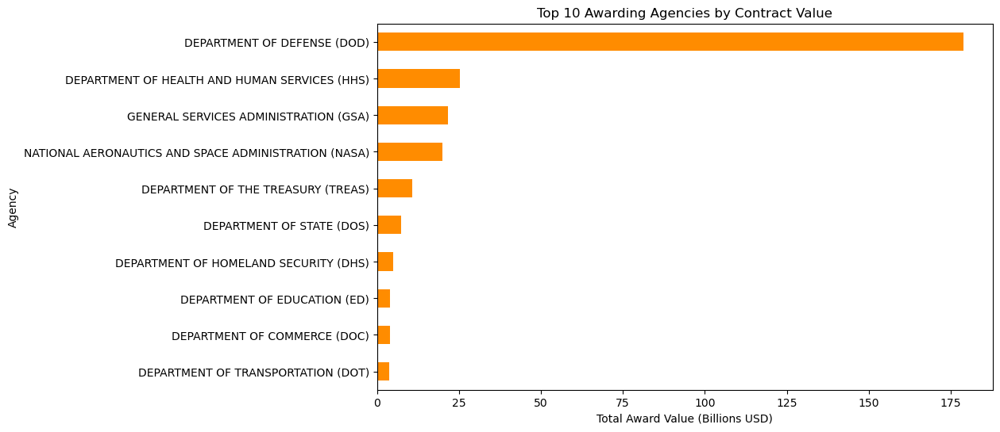
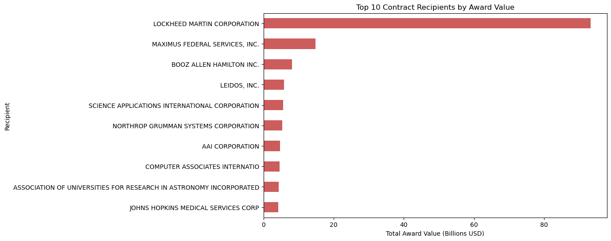
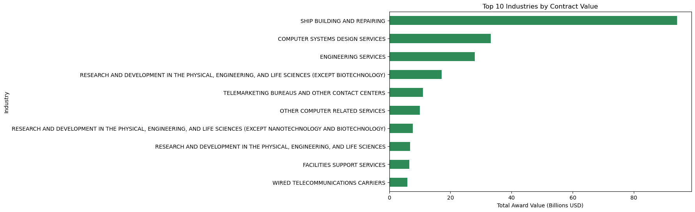

# Government Spending & Budget Analysis Using Python (DMV Focused)

## Overview

This project presents a comprehensive analysis of federal contract spending across the DMV region, specifically Maryland, Virginia, and Washington, DC. The analysis was developed using Python, Pandas, Matplotlib, and Jupyter Notebook to transform large-scale raw federal spending data into structured analytical insights and professional visualizations.

The primary objective of this project is to demonstrate how government spending data can be cleaned, processed, analyzed, and visualized to identify patterns in agency spending, contractor activity, industry concentration, and regional funding distribution throughout the DMV area.

The project combines technical data processing workflows with business-focused interpretation to simulate the type of analytical work commonly performed in public-sector analytics, government contracting environments, and federal reporting operations.

# Business Problem

Federal contract spending data is extremely large, fragmented, and difficult to interpret without proper cleaning and organization. Government agencies, contractors, analysts, and policy stakeholders frequently require structured reporting to understand:

- Which regions receive the largest share of federal spending
- Which agencies dominate contract activity
- Which contractors receive the highest award values
- Which industries depend most heavily on federal funding
- How federal spending is distributed across the DMV region

Without structured analysis, identifying these patterns is difficult and time-consuming.

This project addresses that problem by transforming raw federal contract data into a cleaned, DMV-focused analytical dataset capable of supporting exploratory analysis, reporting, and operational insight generation.

# Project Objectives

The primary objectives of this project were to:

- Clean and structure raw federal contract spending data
- Filter and isolate DMV-focused records
- Automate data preparation workflows using Python
- Analyze spending distribution across Maryland, Virginia, and Washington, DC
- Identify the top awarding agencies by contract value
- Identify the top federal contract recipients
- Analyze industry-level funding concentration
- Generate reusable analytical outputs and visualizations
- Build a professional analytics repository suitable for portfolio presentation

# Dataset & Data Source

The dataset used in this project was derived from federal award and contract spending data originally sourced from USAspending.gov.

The raw dataset includes information related to:

- Federal contract recipients
- Awarding agencies
- Funding agencies
- Award descriptions
- Industry classifications
- Contract values
- Geographic performance locations
- Contract dates

The analysis specifically focuses on records associated with:

- Maryland (MD)
- Virginia (VA)
- Washington, DC

This DMV-focused approach was selected because of the region’s strong concentration of federal agencies, government contractors, defense organizations, and public-sector technology companies.

# Technical Workflow

The analytical workflow was divided into multiple stages:

1. Raw data ingestion using Pandas
2. Column selection and restructuring
3. DMV location filtering
4. Date and numeric conversion
5. Missing value handling
6. Duplicate removal
7. Processed dataset generation
8. Exploratory analysis and aggregation
9. Visualization generation
10. Output export and repository organization

The workflow was intentionally structured to simulate real-world data analytics practices involving large operational datasets.

# Data Cleaning & Preparation

The raw dataset required extensive preprocessing before analysis could be performed effectively.

The cleaning process included:

- Selecting only analytically relevant columns
- Renaming columns for readability and consistency
- Filtering records to DMV states only
- Converting date fields into proper datetime format
- Converting award values into numeric format
- Removing missing or incomplete records
- Removing invalid or negative contract values
- Removing duplicate rows
- Creating processed CSV and Excel outputs
- Creating smaller GitHub-friendly sample datasets

The cleaned dataset significantly improved analytical clarity and reduced unnecessary complexity within the original raw data.

# Data Preview



The preview above displays the cleaned DMV-focused federal contract dataset after preprocessing and filtering. The final dataset includes structured fields related to agencies, contractors, locations, industries, and contract award values.

# Exploratory Analysis & Visualizations

## Federal Contract Spending by DMV State



This visualization compares total federal contract spending across Maryland, Virginia, and Washington, DC.

The results show that Maryland and Virginia account for the largest share of contract spending within the dataset, reflecting the strong concentration of defense, technology, and federal contractor operations throughout these states.

Washington, DC shows comparatively lower direct contract value despite serving as the administrative center for many federal agencies.

## Top Awarding Agencies



This analysis identifies the agencies responsible for the highest levels of contract spending.

The visualization demonstrates the dominance of defense-related agencies and highlights the scale of federal procurement activity concentrated within the DMV region.

The Department of Defense appears as the largest awarding entity, reflecting the region’s strong connection to defense contracting and national security operations.

## Top Contract Recipients



This visualization highlights the organizations receiving the highest contract award values.

Major federal contractors such as Lockheed Martin, Leidos, Booz Allen Hamilton, Northrop Grumman, and Maximus Federal Services appear prominently within the dataset.

This reflects the heavy concentration of government contracting activity throughout the DMV region and demonstrates how federal spending supports large defense, consulting, engineering, and technology organizations.

## Top Industries by Contract Value



This chart identifies the industries receiving the highest concentration of federal contract funding.

Engineering services, defense manufacturing, computer systems design, research and development, and facilities support services represent major funded sectors.

The analysis demonstrates how federal spending activity is strongly concentrated around defense, technology, research, and infrastructure-related industries.

# Key Insights

- Maryland and Virginia represent the majority of federal contract spending within the DMV-focused dataset.
- Federal contract activity is heavily concentrated around defense and technology-related sectors.
- The Department of Defense dominates overall contract award activity.
- Large federal contractors receive a substantial share of total award value.
- Industry concentration suggests strong regional dependence on federal procurement activity.
- The DMV region functions as a major operational hub for federal contracting and public-sector technology services.

# Business Impact

This analysis demonstrates how large-scale government spending data can be transformed into actionable insights that support public-sector reporting, contractor analysis, and budget-focused decision-making.

Potential applications include:

- Government procurement analysis
- Contractor performance reporting
- Regional economic analysis
- Public-sector budget analysis
- Industry funding analysis
- Federal spending transparency initiatives
- Defense and technology sector reporting

The project also demonstrates the importance of structured data preparation when working with large operational government datasets.

# Tools & Technologies

- Python
- Pandas
- Matplotlib
- Jupyter Notebook
- CSV
- Excel
- GitHub

# Project Structure

```text
government-spending-analysis/
│
├── data/
│   ├── raw/
│   │   └── raw_federal_spending.csv
│   │
│   └── processed/
│       ├── cleaned_data.csv
│       ├── cleaned_data.xlsx
│       ├── cleaned_data_sample.csv
│       └── cleaned_data_sample.xlsx
│
├── images/
│   ├── data_preview.png
│   ├── spending_by_state.png
│   ├── top_agencies.png
│   ├── top_industries.png
│   └── top_recipients.png
│
├── notebooks/
│   └── analysis_notebook.ipynb
│
├── outputs/
│   ├── spending_by_state.csv
│   ├── top_agencies.csv
│   ├── top_industries.csv
│   └── top_recipients.csv
│
├── scripts/
│   ├── data_cleaning.py
│   └── analysis.py
│
├── docs/
│   └── project_notes.md
│
├── README.md
└── .gitignore
```
## Data Accessibility

The original raw dataset is large and may not preview directly within GitHub.

To improve accessibility and repository usability, smaller sample datasets are included inside the data/processed/ folder:

cleaned_data_sample.csv
cleaned_data_sample.xlsx

These files provide a lightweight preview of the cleaned DMV-focused dataset while preserving the structure used in the analysis.

## Outputs

The project includes exported analytical summary files inside the outputs/ folder:

spending_by_state.csv
top_agencies.csv
top_industries.csv
top_recipients.csv

These outputs provide reusable summarized analytical results that can support additional reporting, visualization, or downstream analysis.

## Conclusion

This project demonstrates the ability to process large government datasets, automate data cleaning workflows, perform exploratory analysis, generate professional visualizations, and communicate analytical findings clearly using Python and Jupyter Notebook.

The analysis combines technical implementation with business-focused interpretation to simulate real-world public-sector analytics workflows commonly used within government agencies, federal contractors, consulting firms, and data reporting environments.

By integrating structured repository organization, reusable scripts, analytical outputs, and clear visual storytelling, this project provides a complete example of applied government spending analytics focused on the DMV region.

## Author

Daisy Sharma
